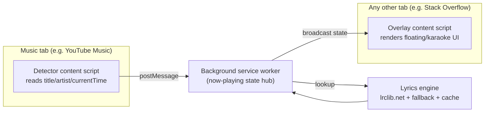

# Lyrically — Product Requirements Document

**Status:** Draft v0.1 — feasibility-reviewed
**Type:** Chrome/Edge browser extension (Manifest V3)
**Tagline:** *Lyrics, wherever you listen.*

---

## 1. Vision

You're listening to music in one tab and working in another. Lyrically detects
what's playing and shows the lyrics as a small, beautiful, fully customizable
overlay that floats on top of whatever page you're actually looking at —
synced to the moment, draggable, and yours to style.

## 2. Problem & Goals

- Lyrics sites force you to alt-tab, break your flow, and are full of ads.
- Native player UIs (YouTube, Spotify) either hide lyrics or lock them inside
  their own app, unavailable while you browse elsewhere.
- **Goal:** a lightweight, non-intrusive companion that surfaces lyrics
  anywhere in the browser, looks intentionally designed rather than like a
  generic extension popup, and is trivially customizable.

---

## 3. Feasibility Analysis

This section exists because the original concept doc described *what* to
build but skipped *how* several core pieces actually work. Below is what
was validated, what needed correcting, and what was simply missing.

### 3.1 Song detection — feasible, but the platform list needs precision

| Platform | Verdict | Notes |
|---|---|---|
| YouTube (youtube.com) | ✅ Feasible, but noisy | Only `document.title` / page metadata is reliably available. Titles are inconsistent ("Artist - Song (Official Video) 4K"), so song identity needs fuzzy parsing, not exact matching. |
| YouTube Music (music.youtube.com) | ✅ Feasible, high reliability | Player bar has clean, dedicated title/artist DOM nodes. Should be the **primary MVP target**, not plain YouTube. |
| Spotify **Web Player** (open.spotify.com) | ✅ Feasible via DOM | This is a real webpage — content script access works. |
| Spotify **Desktop App** | ❌ Not accessible | It's a native Electron shell, not a browser tab. A browser extension cannot see into it at all. The original doc's "Spotify" box conflated these two. If desktop-app support ever matters, the only path is Spotify's official Web API (OAuth-based "currently playing" endpoint) — a separate, heavier integration, not DOM scraping. |
| SoundCloud | ✅ Feasible via DOM | Same caveats as Spotify Web Player. |

**Shared risk across every DOM-based detector:** these are frontend-framework
apps that change their markup/class names periodically without notice. Any
adapter *will* break occasionally. This isn't a reason not to build it — every
comparable extension in the Chrome Web Store has the same constraint — but it
means:
- Detection code should be isolated per-adapter (already planned) so one
  breaking doesn't take down the others.
- Ship a lightweight "detection failed" signal in the UI (rather than silent
  failure) so it's obvious when a selector needs updating.

### 3.2 Lyrics data source — the biggest gap in the original plan

The original doc treats "Fetch lyrics" as a single arrow in a diagram with no
named source. This needs to be decided up front:

| Option | Verdict |
|---|---|
| Genius API | ❌ Metadata/search only — their terms don't permit serving full lyrics text through a third-party API. |
| Musixmatch official API | ❌ Real synced-lyrics access requires a commercial partnership, not available to indie/hobby apps. |
| **lrclib.net** | ✅ **Recommended primary.** Free, open, no auth, purpose-built for time-synced (LRC) lyrics, already the backbone of several existing lyric-overlay tools. |
| Community/plain-text fallback | Needed for the songs lrclib doesn't have — degrade to unsynced scrolling text, then to an honest "lyrics not found" state. |

**Legal note (not legal advice):** lyrics are copyrighted text. Displaying
them without a license is a known gray area that most hobby-scale lyric
tools operate in without issue, but it's a real consideration the moment this
becomes anything commercial or high-traffic — worth revisiting before v2/monetization.

### 3.3 The cross-tab overlay — real idea, needed an actual architecture

The doc's most interesting visual (lyrics floating over Stack Overflow while
the song plays in a Spotify tab) implies something that was never designed:
the overlay has to appear in a tab that **isn't** the one playing the music.
That requires:

1. A **detector content script**, injected only into supported music-site
   tabs, that reads the DOM/video element and locally polls playback position.
2. A **background service worker** acting as the single source of truth for
   "what's currently playing," receiving updates from the detector script.
3. An **overlay content script**, injected into other tabs, that receives
   broadcast state from the service worker and renders the floating UI.

**Important MV3 constraint:** background service workers are non-persistent —
Chrome can terminate and restart them at any time. Karaoke-level sync needs
updates every ~100–250ms, which is too frequent to trust to the background
worker. The polling loop must live in the **detector content script** (which
stays alive as long as the music tab is open); the service worker only
relays state changes, it doesn't poll anything itself.

### 3.4 Sync precision

- **YouTube:** the `<video>` element exposes exact `currentTime` — precise,
  sample-accurate sync is realistic.
- **Spotify Web Player / SoundCloud:** no direct media-element access (playback
  is handled internally); position has to be read from the visible progress
  bar (`aria-valuenow` or the time label). This gives line-level accuracy,
  which is genuinely all karaoke mode needs — not a real limitation in practice.

### 3.5 Verdict

**The product is feasible** for a solo/small build. Nothing here requires
novel technology. The two real costs to plan for, not to be surprised by
later, are: (1) ongoing maintenance of DOM-based detectors as sites update
their frontends, and (2) lyrics coverage/licensing, since no free source
covers every song with synced lyrics.

---

## 4. Revised MVP Scope (v0.1)

Reprioritized based on the feasibility review above:

- **Detection:** YouTube Music (primary, high-reliability) + plain YouTube
  (secondary, fuzzy-matched)
- **Lyrics:** lrclib.net lookup → synced if available, else plain scrolling
  text, else a clear "no lyrics found" state
- **Overlay:** Floating mode only (Karaoke mode moves to v0.2)
- **Position:** draggable, saved per-user via `chrome.storage.local`
- **Customization:** font family, size, weight, background style
  (transparent/glass/solid), opacity
- **Cross-tab display:** the hub/broadcast architecture from §3.3, built from
  day one (it's foundational, not an add-on)

### v0.2
- Karaoke/Focus mode (current line highlighted, prev/next visible)
- Spotify Web Player detection
- Saveable themes/presets
- Keyboard shortcuts
- Visible "detection failed — click to search manually" fallback

### v0.3+
- SoundCloud support
- Spotify official Web API integration (OAuth) for cross-device robustness
- Fullscreen lyrics view
- Translation / phrase-meaning assist *(sourced from the lyrics provider's
  own licensed data where possible, not generated fresh — avoids compounding
  the copyright question from §3.2)*

### Explicitly out of scope for v1
- Any monetization or redistribution of lyrics at scale (revisit licensing first)
- Desktop Spotify app support (impossible without the Web API path)
- Non-Chromium browsers

---

## 5. Functional Requirements

| ID | Requirement |
|---|---|
| FR-1 | Detect currently playing track (title, artist) on supported platforms |
| FR-2 | Resolve detected track to a lyrics source; handle synced, unsynced, and not-found cases distinctly |
| FR-3 | Render a floating overlay on the active tab, independent of which tab is playing audio |
| FR-4 | Overlay is draggable; position persists across sessions |
| FR-5 | Live customization panel (font, size, weight, alignment, background, opacity) with real-time preview |
| FR-6 | Save/apply named presets ("themes") |
| FR-7 | Graceful degradation UI when detection or lyrics lookup fails |
| FR-8 | Extension popup shows now-playing summary independent of the overlay |

---

## 6. Non-Functional Requirements

- **Performance:** content script overlay must not visibly affect host-page
  scroll/render performance; avoid injecting on tabs where it isn't needed.
- **Permissions/privacy:** request the narrowest permission set that works —
  `activeTab` + explicit host permissions for known music domains for
  detection, rather than a blanket `<all_urls>`, to reduce both Chrome Web
  Store review friction and the trust cost to users of a broad-access extension.
- **Resilience:** one broken adapter must not disable detection on other platforms.
- **Offline-friendly caching:** cache resolved lyrics locally to avoid refetching on replays.

---

## 7. Risks & Open Questions

| Risk | Type | Notes |
|---|---|---|
| DOM selectors break on platform UI updates | Technical | Mitigated by adapter isolation + failure surfacing, not eliminated |
| Lyrics coverage gaps | Product | Need an honest "not found" UX rather than pretending coverage is complete |
| Copyright exposure at scale | Legal | Low risk at hobby scale; revisit before any monetization |
| Scraping may conflict with platform ToS | Legal | Common among existing lyric-overlay extensions; worth tracking, not a hard blocker |
| Broad host permissions may hurt Chrome Web Store approval/trust | Product | Scope permissions per platform explicitly |

**Open questions to resolve before/while building:**
- Do we ship Spotify Web Player detection in v0.1 or hold for v0.2 as scoped above?
- What's the exact fallback lyrics source when lrclib has no match?
- How aggressively do we cache lyrics locally vs. re-checking for corrections?

---

## 8. Success Signals (early stage)

- Detection success rate on supported platforms (target: track it, not guess it)
- % of detected songs with lyrics successfully resolved (synced or plain)
- Retention: overlay still active after first week of install
